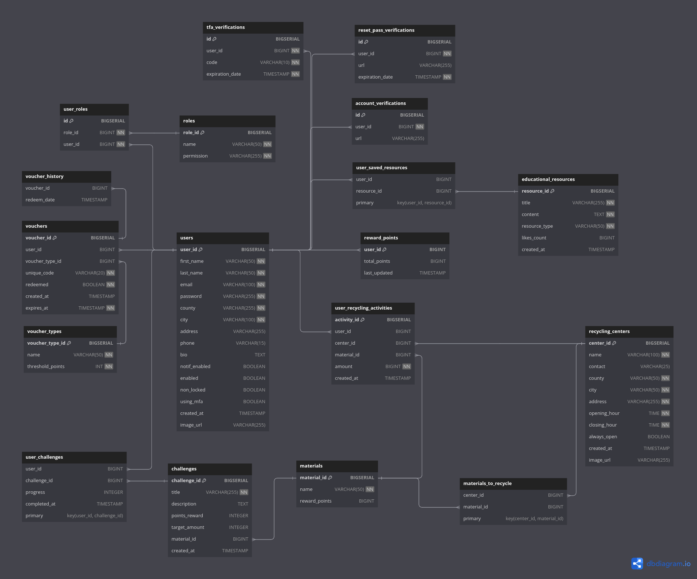

# .msgRecyclingRewards - BACKEND (Work in progress...)

**[!] The DB schma for the app is documented on [dbdocs.io](https://dbdocs.io/nandavid190/RECYCLING-REWARDS-DB).** (updates will likely be made)

## Overview

RecyclingRewards is a robust, scalable, and secure fullstack application designed to foster more sustainable activities within the community.

Users can actively engage with participating recycling centers, contribute recyclable materials, track rewards based on their sustainable actions, and efficiently manage and redeem vouchers. The platform also provides access to educational resources, articles, and events promoting a sustainable lifestyle, fostering community engagement, and encouraging friendly competition among recyclers.

The project is built as part of a competition amongst 2nd and 3rd Year CS Student, organised by [.msg Systems Romania](https://www.msg-systems.ro/en/). The curated list of requirements for the application can be found in [REQUIREMENTS.md](REQUIREMENTS.md).

## Database Schema Overview

## Backend Tech Stack

- **Spring Boot 3.2**
- **Spring Security 6.2**
- **Spring JPA**
- **Spring JDBC**
- **PostgresSQL**
- **Maven**
- **Docker** (soon)
- **AWS** (soon)

## License

This project is licensed under the [Apache License, Version 2.0](LICENSE).

---

**Apache License, Version 2.0**