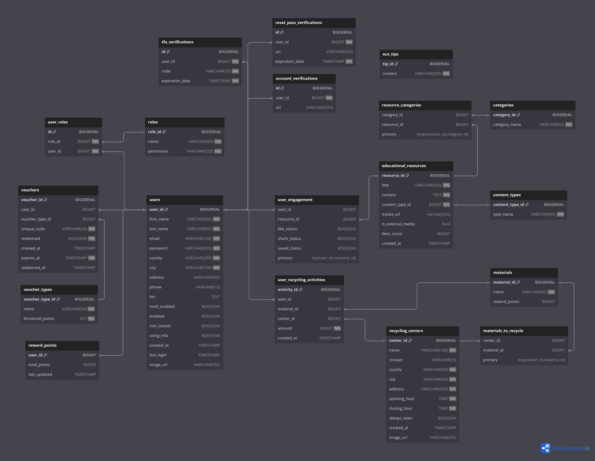

# .msgRecyclingRewards - BACKEND

The .msgRecyclingRewards project is a secure and scalable full-stack platform designed to promote sustainable activities within communities. The application, developed as part of a competition organized by [.msg Systems Romania](https://www.msg-systems.ro/en/), provides users with the ability to actively engage with recycling centers, contribute recyclable materials, track rewards, manage vouchers, and access educational resources for a more sustainable lifestyle. 

The application is fully Dockerized, build for multiple environments, built with extensibility and scalability in mind, architecture-wise it adheres to DDD and follows SOLID principles.

**Requirements:** [REQUIREMENTS.md](REQUIREMENTS.md)

***This is the BACKEND repository of the application. In order tho access the FRONTEND repository along with its documentation and an overview of the app, please click [HERE](https://github.com/davidandw190/.msg-recycling-rewards-frontend)**

## Topics

- [Backend Tech Stack](#backend-tech-stack)
- [Persistence Architecture](#persistence-architecture)
- [Authentication Features](#authentication-features)
- [Core Application Features](#core-application-features)
- [Additional Features](#additional-features)
- [TODO](#TODO)
- [License](#license)

## Persistence Architecture

[DB Schema on dbdocs.io](https://dbdocs.io/nandavid190/RECYCLING-REWARDS-DB)

## Backend Tech Stack

- **Spring Boot 3.2**
- **Spring Security 6.2**
- **Spring JPA**
- **Spring JDBC**
- **PostgresSQL**
- **Maven**
- **Docker**
- **AWS (soon)**

## Authentication Features

- **User Registration, Login & Logout Mechanisms:** Users can register, log into their accounts and log out.

- **Role-Based Access Control:** The application features granular role-based access control for improved security.

- **Session Management:** Employed JWT Access and Refresh Tokens for robust and stateless session management.

- **Multi-Factor Authentication (MFA) via SMS:** Users can toggle MFA once they add a valid phone number to their account.

- **External Password Reset:** Streamlined password reset through email code validation.

## Core Application Features

- **User Profile Management:** Users can manage and edit their profile details, change their profile picture, toggle Email Notifications, toggle MFA, etc.

- **Recycling Center Creation, Management:** ADMINS and SYS_ADMINS can create, manage and update center information, opening hours, accepted recycling materials.

- **Robust Recycling Centers Search & Filtering:** Facilitates paginated recycling centers search with various criteria, combinations, and ordering options.

- **Dynamic Material Recycling:** Users can submit recycling materials to be collected by their preferred recycling centers. Each material type has its own value, unit measure options that the user can select from, and contributes in its own way in the user Rewards Points.

- **Reward Points and Sustainability Index Management:** Users can track these based on their sustainable actions each month.

- **Voucher Earning and Redemption:** Users are automatically notified when they have enough Reward Points to redeem a Voucher, they can efficiently manage and redeem vouchers.

- **Competition Among Recyclers:** The platform fosters friendly competition among recyclers, encouraging a sense of community and shared environmental responsibility.

- **Management, Access to Educational Resources:** The application provides access to educational resources, articles, infographics, videos and events promoting a sustainable lifestyle. These can be uploaded by SYS_ADMINS or ADMINS, and can even be Youtube Videos or user-uploaeded videos.

- **Educational Resources Engagement:** Allow users to like, save, and share educational resources. Track and filter liked or shared resources for easy access.

- **Educational Resources Search and Filtering**

## Additional Features

- **Scheduled and Unscheduled Jobs and Emails:** Execution of scheduled and unscheduled automated tasks, such as monthly reward points reset, sending detailed monthly statistics emails to users.

- **Excel Report Exports:** The platform provides users with the ability to export reports such as the details and activities of all recycling centers in Excel format.

- **Media Handling:** The platform supports seamless image and video uploads, embedding, and streaming.

## TODO

- [ ] Deploy on AWS EC2
- [ ] Integrate Security Logs
- [ ] Improve Modularity
- [ ] Add Redis Caching

## License

This project is licensed under the [Apache License, Version 2.0](LICENSE).
